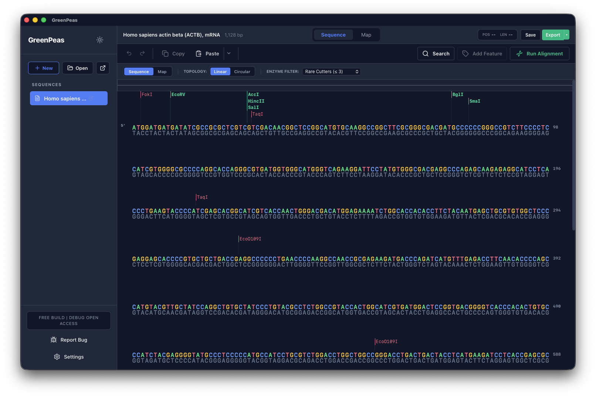

# GreenPeas Public Beta

[English README](README_en.md)

GreenPeas は、DNA 配列の編集やクローニング作業を行うための macOS デスクトップアプリです。

このリポジトリでは、GreenPeas の公開ベータ版をバイナリのみで配布しています。ソースコードは含まれていません。

## 特徴

- Rust と Tauri を使ったネイティブ寄りの構成で、メモリ使用量を抑えた軽快な動作を目指しています。
- 配列表示、アノテーション、プライマー、制限酵素、アラインメント、クローニング作業を 1 つのワークスペースで扱えます。
- Apple Silicon Mac 向けにビルドしたベータ版です。

## できること

- DNA 配列ファイルを開く、編集する
- GenBank 系ファイルや SnapGene 由来ワークフローを扱う
- 配列をリニア表示やマップ表示で確認する
- アノテーション、プライマー、制限酵素サイトを表示・管理する
- 制限酵素フィルターや rare cutter 表示を使って配列を確認する
- アラインメントを実行する
- クローニング向けの fragment 処理や Smart Ligation validation を行う
- 複数の配列をワークスペース内で扱う
- アプリ内からバグ報告用メールを作成する

## 現在のベータ版

- バージョン: `v0.1.0-beta.1`
- 対応環境: macOS Apple Silicon
- ダウンロード: `GreenPeas_0.1.0_aarch64.dmg`
- SHA-256: `84e0f1327535e405f7cd8aa3e9d1285b1232c89584c8919b2a955f031510f07c`

## ベータ版について

このベータ版は、動作確認とフィードバック収集を目的としています。重要な実験データや作業データについては、GreenPeas だけに保存せず、必ず別途バックアップを保管してください。

このベータ版は、コード署名および notarization を行っていません。DMG を開く前に、SHA-256 checksum を確認してください。

## 同梱ファイル

- `GreenPeas_0.1.0_aarch64.dmg`
- `GreenPeas_0.1.0_aarch64.dmg.sha256`
- `RELEASE_NOTES_v0.1.0-beta.1.md`
- `screenshots/main-window.png`
- `LICENSE`
- `THIRD_PARTY_LICENSES.txt`

## フィードバック

ベータ版へのフィードバックは `ryuki.abriu@gmail.com` までお送りください。

可能であれば、以下の情報を含めてください。

- GreenPeas のバージョン
- 使用している macOS のバージョン
- 使用したファイル形式
- 再現手順
- 期待した動作
- 実際に起きた動作
